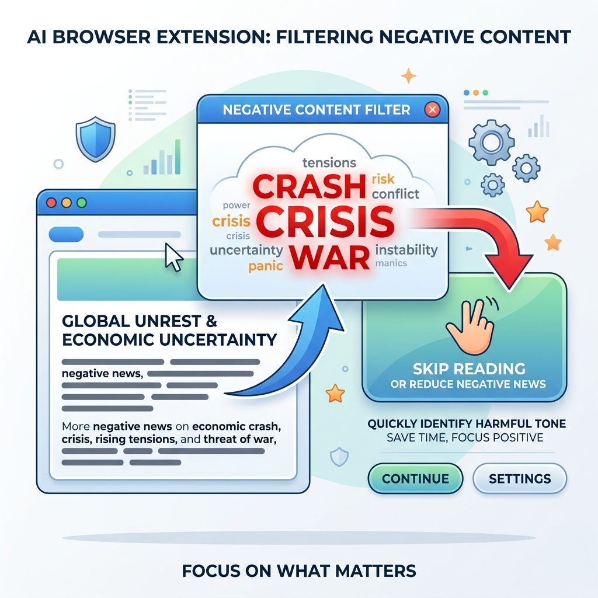

# Super Charged TLDR

A powerful suite of browser reading tools built directly into a lightweight Chrome extension. Get quick summaries, estimate your reading time, analyze word clouds, and create a zen reading experience on any page without sending a single byte to an external server.

## Features
- **AI Summary (NVIDIA Builder API):** Generates a 5-bullet summary of the current webpage using `meta/llama-3.3-70b-instruct`.
- **Reading Time Estimator:** Automatically calculates roughly how many minutes it will take to read the page.
- **Interactive Word Cloud:** Find out what the text is about instantly. Click any word to instantly jump to and highlight it on the page.
- **Zen Mode:** A one-click toggle to remove ads, sidebars, and navigation, forcing the page into a clean, dark-mode reading style.
- **Fallback Summary:** If no NVIDIA key is found, the extension falls back to a local 5-sentence extractive summary.

## How to Install
1. Add your NVIDIA Builder API key in `wordcloud-extension/.env`:
  - `NVIDIA_API_KEY=your_real_key_here`
2. The repository `.gitignore` excludes `wordcloud-extension/.env` so the key is not pushed.
3. Open Google Chrome.
4. In the URL bar, go to `chrome://extensions/`.
5. In the top right corner, turn on **"Developer mode"**.
6. Click the **"Load unpacked"** button that appears in the top left.
7. Select the `wordcloud-extension` directory.

## How to Use
1. Navigate to any article, blog post, or long text webpage.
2. Click the extension icon in your Chrome toolbar.
3. Observe the **Reading Time** at the top right of the popup.
4. By default, you will see the **Word Cloud**. Click on any key term in the cloud, and Chrome will jump to where that word is used on the page.
5. Click the **Summary** tab to read a 5-bullet summary of the article.
6. Click **Toggle Zen Mode** to instantly convert the messy webpage into a dark-themed, distraction-free reading experience. Click it again to revert.

## How to Maintain and Develop
- `manifest.json`: Configuration for the extension. Uses Manifest V3. Requires `activeTab` and `scripting` permissions.
- `popup.html`: The user interface of the extension. It controls the tabbed layout (Word Cloud vs Summary) and action buttons.
- `popup.js`: Contains both the frontend UI logic and the injected execution logic.
  - The functions `analyzePageText`, `toggleZenModeOnPage`, and `highlightWordOnPage` are written as self-contained functions that are specifically injected into the current active webpage's execution context.
  - Due to this isolation, these injected functions cannot reference external variables or imports from `popup.js` outside of their scope unless passed as arguments.
  - If making styling tweaks to Zen mode, modify the CSS template literal injected inside `toggleZenModeOnPage`.

## Guarding Against Negative News

This extension serves as an essential tool for **protecting your mental well-being**. In an era dominated by doomscrolling, you can use the word cloud feature as a quick "vibe check" before committing your time to reading an article.

### How it helps:
1. When you open a news article, open the extension before reading.
2. Quickly glance at the **Word Cloud**.
3. If the most prominent words lean heavily toward terms like **crash, crisis, destruction, or panic**, you can instantly discern the negative tone of the article, without absorbing the toxic content.
4. Skip the read if you choose. You save time, protect your mindset, and still vaguely know what the page was about!

***

## In Action

## Demo Video
[Watch on YouTube](https://youtu.be/PB8sRTeIovU)

## License
MIT